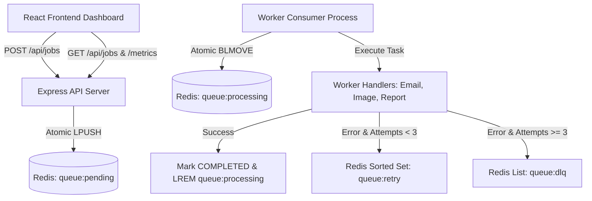

# ⚡ Distributed Task Queue & Worker Engine

> A high-performance, fault-tolerant asynchronous background task processing engine built with **Node.js, Express, Redis v7, and React 19**. Features atomic queue polling, exponential backoff retries, dead-letter queue (DLQ) isolation, and a real-time monitoring dashboard.

---


---

## 🏗️ System Architecture



---

## ⚡ Core Engineering Features

- 🔐 **Atomic Queue Operations**: Uses Redis `BLMOVE` (or `BRPOPLPUSH`) to atomically move tasks from `queue:pending` to `queue:processing`. Prevents job loss if a worker crashes mid-execution.
- ⏳ **Exponential Backoff Retries**: Calculates delay $t = 2^{\text{attempts}} \times 1000\text{ms}$ and schedules retries in a Redis Sorted Set (`queue:retry`) using timestamp scores.
- ☠️ **Dead-Letter Queue (DLQ)**: Permanently failed tasks ($\ge 3$ attempts) are safely isolated in `queue:dlq` to prevent poison-pill jobs from blocking system execution.
- 🛠️ **3 Concrete Worker Handlers**:
  1. `EMAIL`: Transactional HTML email delivery simulation.
  2. `IMAGE`: CPU-bound image resizing and avatar thumbnail generation simulation.
  3. `REPORT`: Database query aggregation & PDF report generation simulation.
- 📊 **Real-time Monitoring Dashboard**: Live queue metrics, task execution inspector, expandable error logs, and one-click DLQ re-queue action.

---

## 🔌 API Endpoint Documentation

| Method | Endpoint | Access | Description |
| :--- | :--- | :--- | :--- |
| `POST` | `/api/jobs` | Public | Enqueue a new async task with priority & payload |
| `GET` | `/api/jobs` | Public | Fetch all tasks with status, payload, and retry history |
| `POST` | `/api/jobs/dlq/retry` | Public | Move job from Dead-Letter Queue back to `queue:pending` |
| `POST` | `/api/jobs/clear` | Public | Purge completed tasks from Redis storage |
| `GET` | `/api/metrics` | Public | Fetch real-time queue depth & execution metrics |

---

## 🛠️ Installation & Setup

### Prerequisites
- [Node.js v18+](https://nodejs.org/)
- [Redis v7+](https://redis.io/) (or Docker)
- [Docker & Docker Compose](https://www.docker.com/)

---

### Option A: Running with Docker Compose (Recommended)

```bash
# 1. Clone & Enter Directory
cd task-queue-engine

# 2. Spin up Redis, API, Worker, and Frontend stack
docker-compose up --build
```
- **Frontend Dashboard**: `http://localhost:3001`
- **Backend API**: `http://localhost:5001`

---

### Option B: Running Locally for Development

1. **Start Redis Server**:
   ```bash
   docker run -d --name task_queue_redis -p 6379:6379 redis:7-alpine
   ```

2. **Start Backend API**:
   ```bash
   cd backend
   npm install
   npm run dev
   ```

3. **Start Worker Process**:
   ```bash
   cd worker
   npm install
   npm run dev
   ```

4. **Start Frontend Dashboard**:
   ```bash
   cd frontend
   npm install
   npm run dev
   ```

---

## 🎯 Interview Deep Dive & Defense Guide

When asked about this project in technical interviews:

### Q1: Why did you use Redis for the task queue instead of a standard SQL database?
> **Answer**: Redis operates in-memory with single-threaded event loop atomicity. Redis data structures like Lists (`LPUSH`, `BLMOVE`) and Sorted Sets (`ZADD`) allow $O(1)$ enqueue and pop operations without the overhead of SQL row-locking (`SELECT FOR UPDATE`), making it ideal for low-latency task scheduling.

### Q2: How does your worker guarantee zero task loss if a node crashes mid-task?
> **Answer**: Instead of using non-atomic `LPOP`, the worker executes `BLMOVE queue:pending queue:processing LEFT RIGHT`. This atomically pops the item from pending AND pushes it to processing in a single operation. If the worker process dies mid-task, the job remains in `queue:processing` where an orphaned-job watchdog process can recover it.

### Q3: How is exponential backoff implemented using Redis Sorted Sets?
> **Answer**: When a task fails, we increment its attempt counter and compute the backoff time $t = \text{now} + 2^{\text{attempts}} \times 1000\text{ms}$. We store the task ID in Redis Sorted Set `queue:retry` with score = $t$. A background scheduler process periodically calls `ZRANGEBYSCORE queue:retry 0 <current_timestamp>` to atomically pull and re-queue due tasks back into `queue:pending`.
